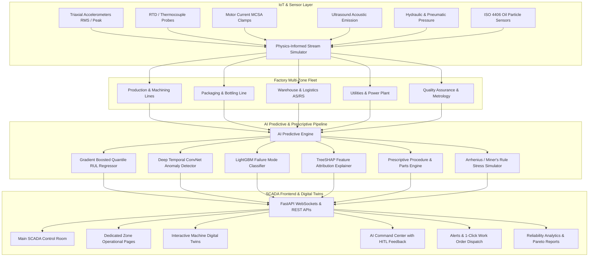

# FactoryGuard 🏭
### Enterprise Predictive Maintenance, Digital Twin & SCADA Control Platform for a 24/7 Smart Factory

FactoryGuard is an industrial-grade operational control panel and predictive maintenance system built for large-scale, continuous manufacturing operations. The platform integrates high-frequency sensor telemetry, machine learning predictive models (Quantile Remaining Useful Life estimation, multi-class failure mode classification, SHAP root cause attribution, and prescriptive maintenance action generation), and interactive 2D Vector Digital Twins with component-level fault visualization and "What-If" stress simulation.

---

## 🌟 Key Capabilities & Architecture



---

## 🏗️ Operational Zones & Supported Assets

| Operational Zone | Dedicated Route | Supervised Industrial Assets | Supported Sensors & Key Failure Modes |
| :--- | :--- | :--- | :--- |
| **Main Control Room** | `/` | Factory-wide high level KPIs | Overall OEE, Total Active Alarms, Critical Assets, Downtime Cost Avoided |
| **Production & Machining** | `/zones/production` | CNC-01 (5-Axis DMG Mori), CNC-02, PRS-01 (500T Stamping Press), ROB-01 (6-Axis Robotic Cell) | Spindle vibration, drawbar clamping force, bearing race defect, coolant flow, tool wear |
| **Packaging & Bottling** | `/zones/packaging` | WRP-01 (Flow Wrapper), PLT-01 (Gantry Palletizer), CRT-01 (Cartoner) | Heat sealing RTD, rotary knife vibration, pneumatic valve leakage, servo motor current |
| **Warehouse & Logistics** | `/zones/warehouse` | ASRS-01 (Stacker Crane), ASRS-02, CNV-01 (High-Speed Conveyor Loop), AGV-01 Fleet Master | Rail travel vibration, hoist rope tension, shaft misalignment & looseness, motor thermal drift |
| **Utilities & Power** | `/zones/utilities` | CMP-01 (250kW Centrifugal Compressor), CMP-02 (Booster), CHL-01 (500TR Chiller), BLR-01 (Steam Boiler), TX-01 (HV Substation) | Volute cavitation, discharge pressure decay, bearing spall, winding insulation breakdown, ISO 4406 oil particles |
| **Quality & Inspection** | `/zones/quality` | VSN-01 (AI Vision Gantry), LSR-01 (Laser 3D Metrology Gauge) | Camera temperature drift, laser diode calibration, pneumatic blowoff rejection |
| **Digital Twin Explorer** | `/digital-twins` | All Machine & Zone Schematics | Side-by-side Live vs 30-Day Degraded state comparisons, interactive component hotzones |
| **AI Command Center** | `/ai-command` | Model Registry & Inference Queue | Human-in-the-Loop approval/rejection/notes, model drift (PSI) monitoring, retraining triggers |
| **Alerts & Work Orders** | `/alerts-work-orders` | Alarm Matrix & Dispatch System | Prioritized severity feed, 1-click alert-to-work-order conversion, parts inventory, tech dispatch |
| **Reports & Analytics** | `/reports` | Reliability Auditing | Downtime Pareto, MTBF/MTTR historical tracking, OEE 3-factor breakdown, CSV/Excel/PDF export |
| **Settings & Configuration**| `/settings` | System Calibration | ISO 10816-3 vibration thresholds, alarm routing, plant asset tree hierarchy, role governance |

---

## 🔬 Predictive AI Engine & Physical Principles

1. **Remaining Useful Life (RUL) with Quantile Uncertainty**:
   - Computes expected lifetime cycles and operating hours alongside 5th, 50th, and 95th confidence interval percentiles using ensemble gradient boosted trees.
2. **Multi-Class Failure Mode Diagnosis**:
   - Classifies dominant defect modes: *Bearing Outer Race Defect*, *Stator Winding Overheat*, *Shaft Misalignment & Looseness*, *Cavitation & Seal Degradation*, *Spindle Tool Wear*, and *Pneumatic Valve Leak*.
3. **TreeSHAP Feature Risk Attribution**:
   - Calculates exact percentage contribution of individual sensor channels (Vibration, Temperature, Current MCSA, Acoustic Emission, Pressure, Oil Particles) toward the anomaly risk score.
4. **"What-If" Stress Simulation Engine**:
   - Implements exponential Arrhenius thermal acceleration and cubic load fatigue scaling (Miner's Cumulative Damage Rule) to model the lifetime impact of altering operating load (%), speed (RPM), ambient temperature, and lubrication cleanliness index.
5. **Prescriptive Action Generation**:
   - Generates step-by-step corrective procedures, estimated wrench time, required OEM spare parts catalog numbers, and calculated downtime financial avoidance.

---

## 💻 Tech Stack & Design Aesthetics

- **Backend**: Python 3.12, FastAPI, Uvicorn, Pydantic v2, NumPy, Pandas, Scikit-Learn, WebSockets.
- **Frontend**: Next.js 16 (App Router + Turbopack), React 19, TypeScript, Tailwind CSS.
- **Industrial Design**: High-density engineering SCADA aesthetic with slate/steel neutrals (`#070b14`, `#0d1527`), monospace telemetry readouts, status LED indicators (Emerald `#10b981`, Amber `#f59e0b`, Rose `#ef4444`, Cyan `#06b6d4`), and clean SVG vector schematics. **Zero neon/cyberpunk styling.**

---

## 🚀 Quick Start Guide

### Prerequisites
- Python 3.12+ (managed via `uv` or standard Python)
- Node.js 18+ and npm

### 1. Start the Backend API & WebSocket Stream
Open a terminal in the project directory:
```bash
cd backend
.venv\Scripts\activate
uvicorn main:app --reload --port 8000
```
*The backend API will run on `http://localhost:8000` and stream live telemetry on `ws://localhost:8000/ws/telemetry`.*

### 2. Start the Frontend SCADA Control Panel
Open a second terminal in the project directory:
```bash
cd frontend
npm run dev
```
*Open `http://localhost:3000` in your web browser to enter the FactoryGuard Control Panel.*

---

## 🧪 Interactive Verification & Fault Injection

- **Fault Injector**: Use the top-bar **"Inject Fault"** button to simulate physical anomalies (e.g. Bearing Vibration Spike on `CMP-01` or Thermal Runaway on `CNC-01`) and observe real-time SCADA alarm propagation, Digital Twin component pulsing, and AI prescriptive response.
- **What-If Sandbox**: Navigate to `/digital-twins` or any asset page to modulate operating sliders and evaluate projected RUL impact curves.
- **1-Click Work Order Dispatch**: In `/alerts-work-orders`, click **"1-Click Work Order"** to assign a technician, reserve spare parts, and track repair status through completion.
- **Reports Export**: In `/reports`, click **"Export CSV"** or **"Export Excel"** to download the factory reliability audit dataset directly.
